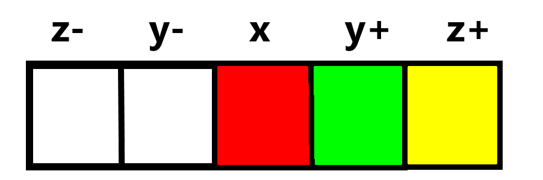

# About LIN3N

This is a program that simulates an N-dimensional 3-layered Rubik's Cube puzzle. By projecting the puzzle into a 1-dimensional fractal representation, all stickers that make up a single piece are connected to each other, increasing piece readability at the sacrafice of puzzle coherency.

# Understanding the view
The 1D representation is somewhat based on [MagicCube7D](https://superliminal.com/andrey/mc7d/)'s fractal representation of 5D-7D Rubik's Cubes. In LIN3N, ND space is divided into 1 primary, and (N-1) secondary dimensions. Each piece shows a single sticker for the x-axis position, and 2 potential spots for stickers for each remaining dimension. This is based on which side from that axis is positive or negative. For example on the 3D 3x3x3, The positive x-axis side is the Right, positive y-axis is Up, and positive z-axis is Front. This generalizes to higher dimensions too.

For example, take the Red Yellow Green corner on the 3^3 (normal Rubik's Cube). When the puzzle is solved (and held with White on top and Green in front), it will look like this because the sticker on D (negative y-axis) is yellow, the sticker on R (x-axis) is red, the sticker on F (positive z-axis) is green, and there are no stickers on any of the other axes on that piece. Even though there are 5 spots to have stickers, only a maximum of 3 can be filled in at any time on a piece.

From this position, imagine performing an R move on the puzzle. The Red Yellow Green piece will move to a different spot in the puzzle, but its orientation changes too. Red Yellow Green is the DFR corner, and it moves to UFR after an R move. The UFR piece only has stickers on the positive axes. This is what it will look like after the move:

When you load a solved puzzle, you'll see the piece with all negative axis stickers is the leftmost piece, and the rightmost piece has all positive axis stickers. Because the x-axis is the primary axis in 1D space, the left 1/3 of the puzzle contains all pieces on the left side, the middle 1/3 of the puzzle represents the slice layer between left and right, and the right 1/3 contains all the pieces on the right side. Its a little trickier to find all the pieces of sides that aren't on the x-axis, but piece finding or puzzle rotations will be able to help.

# Features
## Current
- 3^1 to 3^8 (currently non functional)
- zoom and pan around the puzzle
- fullscreen or fixed 800x800 px window size 

## Upcoming
- 3^N (I will probably cap N for performance reasons, but this program should still be able to simulate higher dimensional puzzles that no other program has before)
- puzzles will be functional
- customize puzzle and menu colours
- piece finding
- piece filters
- possibly macros
- timer that works properly
- twist count
- saving and loading solves from files
- preferences that stay when you close and reopen the program

# Installation

1. Download [Processing](https://processing.org/download)
2. Open all the files from this repository in Processing
3. Click the run button in the Processing UI

In the future, releases will contain a single exe file so that running the program will be much simpler.
